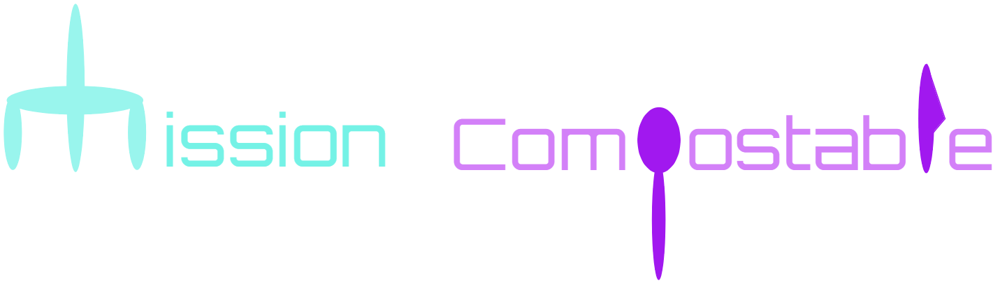

# Mission Compostable
An app that distinguishes between plastic and compostable utensils to save them from the landfill!

Check it out [here](https://mission-compostable.herokuapp.com/) while we wait for our domain name, www.missioncompostable.online, from Domain.com to resolve.

The backend repo is [here](https://github.com/jeanruggiero/mission-compostable-django).

To explore Mission Compostable's image processing engine and play around with real data, check out this [Jupyter Notebook](https://github.com/jeanruggiero/mission-compostable/blob/master/com-python/image_processing_engine.ipynb)!

## Collaborators
- Ngoc (Ruby) Ngo
- Catherine Ng
- Sholpan Kalikova
- Jean Ruggiero

## Describe your project in a tweet!
We're on a mission to save compostable utensils from the landfill! These items won't break down in a landfill so we're using tech for good to make sure they make it to the nearest composting facility.

## What inspired you to make this?
People don't always know what type of trash cans they should put their trash in; hence, they ended up putting the trash in the wrong trash can. Being aware of that, we want to create a compostable and plastic recognizer to help people determine where to put their trash in and, in a  larger scale, protect the environment.
## What does your project do?
Our project is an environmental hack that can conduct image analysis to distinguish different materials of spoons (compostable vs. plastic). 

## How did you build it?
We start with exploring some different technologies to see which would be best suited to solve the problem. Then, we experimented to decide if it would be technically feasible to solve the problem. With those hurdles out of the way, we started hacking! First, we collected samples and we did some exploratory data anlysis to determine the best model parameter processing for the images. After that we have some time left, so we build some front-end for the project.
## What challenges did you face?
We was trying to figure out the appropriate packages to conduct our image analysis. We used a combination of OpenCV and Scikit-Image. 

## What accomplishments are you proud of?
Staying up late at night drinking Monster Energy drinks, while single-handly devouring pizzas and cookies in one hand and typing desperately on the computer with the other hand. 

## What did you learn while building this?
We learned how to use CSS, image processing, build and design a website.
## What's next for your project?
In the future, we will add samples of other utensils to the program. Ultimately, we want to build a machine that scan utensils,then filtering and directing them to the right compostable or plastic trash can. 
